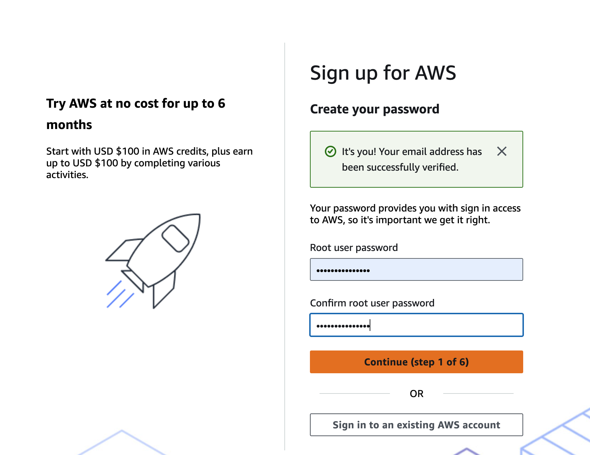

# Amazon Web Services (AWS) - Free Tier Account Set up

AWS Free Tier program allows new customers to explore AWS services at no cost for up to 6 months. New customers receive up to $200 in AWS credits — $100 upon sign-up and up to $100 more as you explore foundational AWS services. 

You can access over 30 services with always free offers. Services with an Always Free offer allow you to use the product for free up to specified limits as long as you are an AWS customer.

The AWS Free Tier is available to all new customers – students, entrepreneurs, and small businesses are all welcome to sign up online. 

You would be ineligible for free plan or Free Tier credits if you have an existing AWS account or have had one in the past. The free plan and Free Tier credits are available only to new AWS customers.

Free Tier credits expire 12 months from the date you create your AWS account or if you convert your subscription to a Paid Plan.

> NOTE : When your account joins an AWS Organization or sets up an AWS Control Tower landing zone, your Free Tier credits expire immediately, and your account will be ineligible to earn more AWS Free Tier credits. 
Additionally, your free account plan will automatically be upgraded to a paid plan. 

To get started, go to the official [AWS](https://aws.amazon.com/free) website. Click on **[Create Free Account](https://portal.aws.amazon.com/gp/aws/developer/registration/index.html)** button to begin the sign-up process.

Enter Your Email and Account Name.

You’ll need to provide your email address and choose a unique AWS account name. 

AWS will send a verification code to your email address. Enter this code on the sign-up page to confirm your email.

Next, choose a strong password for your root user account. The root user has full access to all AWS resources.

Click **Continue** to proceed to the next step and select the account plan.

Choose "Free" by clicking on **Choose free plan**.

Next you will enter your personal information. 

For the question **How do you plan to use AWS?** select **Personal - for your own projects**.

Fill in details like your full name, contact number, country, and address.

Click **Continue** to proceed to the next step and confirm your identity via SMS or Voice Call.

Choose a verification method and proceed with the instructions.

 

On completed, you should be able to access the [AWS Management Console](https://eu-north-1.console.aws.amazon.com/console/home?region=eu-north-1#).