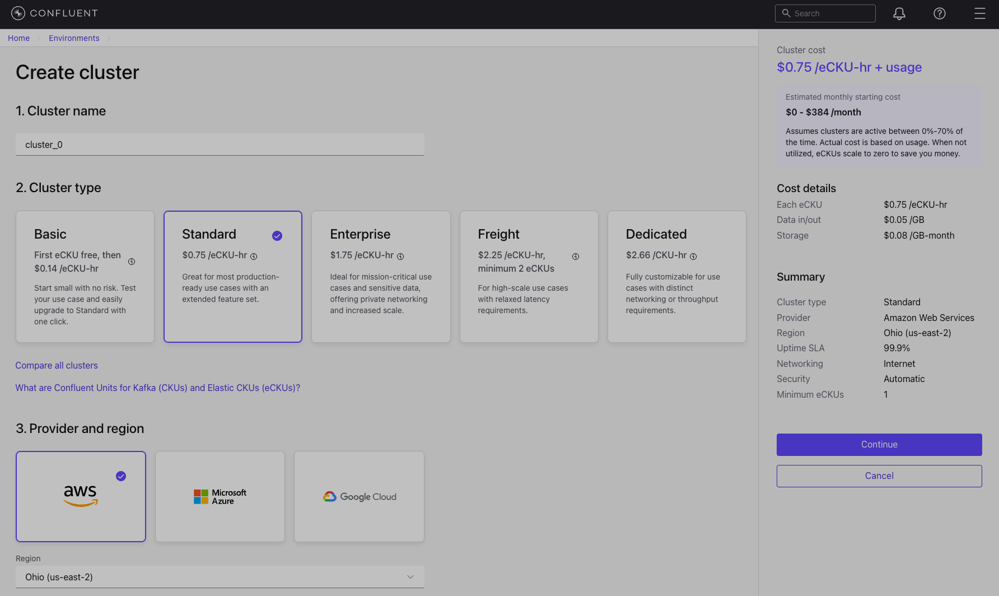

# Confluent Cloud

Open your browser and navigate to : https://www.confluent.io/get-started/

Either signin with an existing Google or Github account, or enter your details manually.

Enter additional profile details and click **Submit**:

You can skip inviting your teammates for now by clicking on **Skip**:

Provide te relevant details about your expertise and click on **Next**:

We won't create a cluster yet, so click on **Explore other cluster types & pricing**:

Click on **Cancel** to prevent the cluster to be created:

You should now reach your environment overview:

