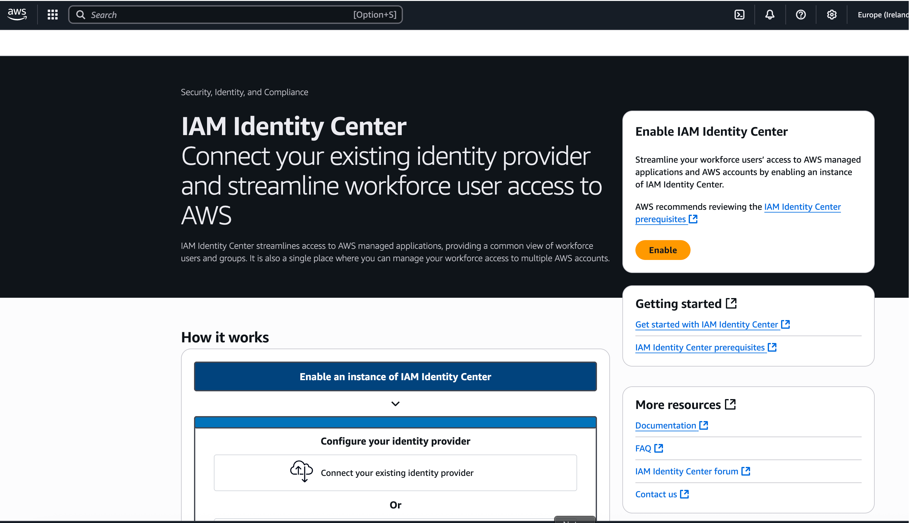
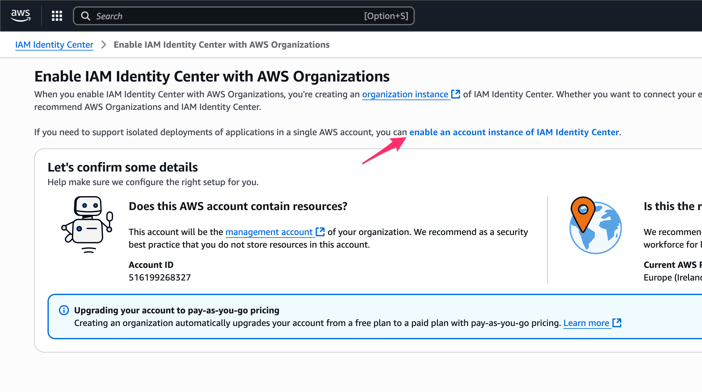
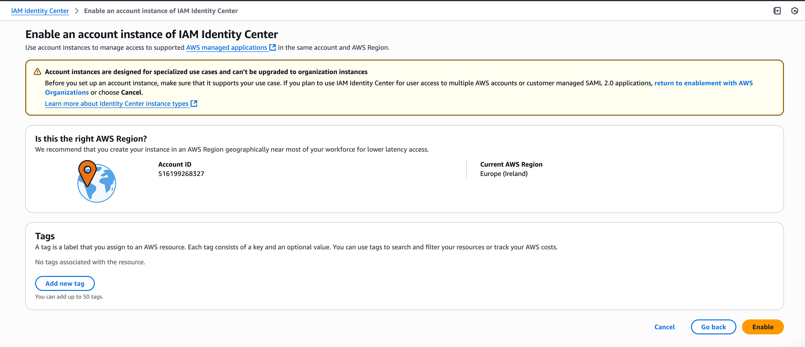
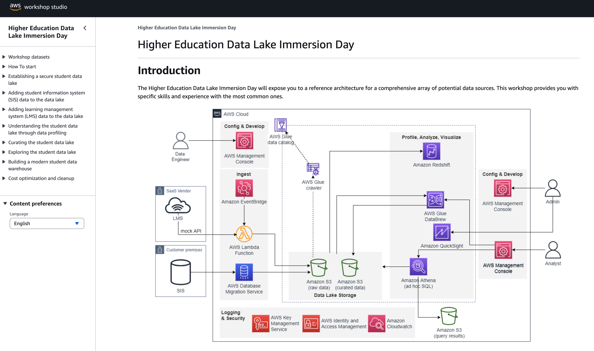
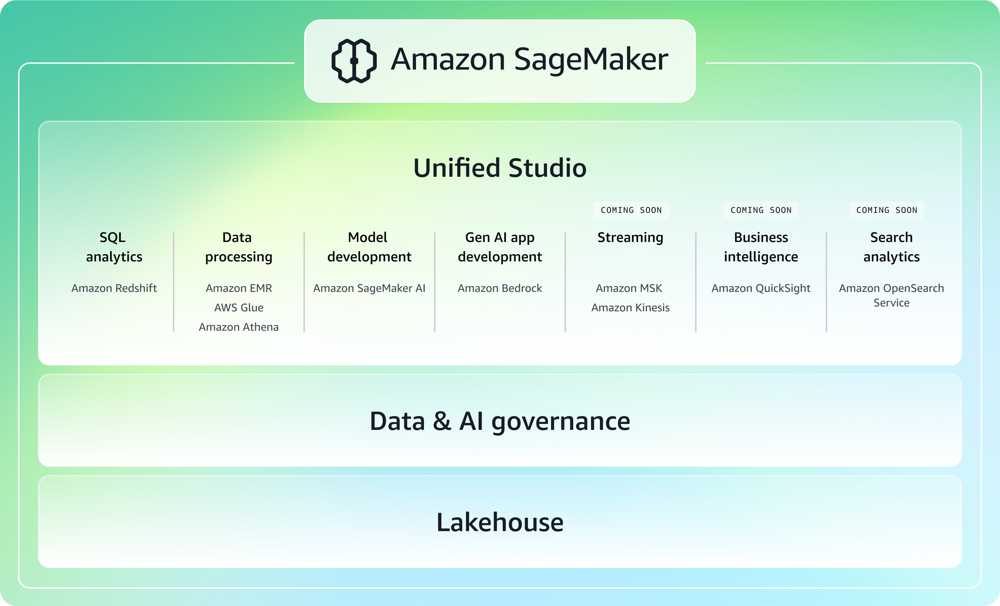
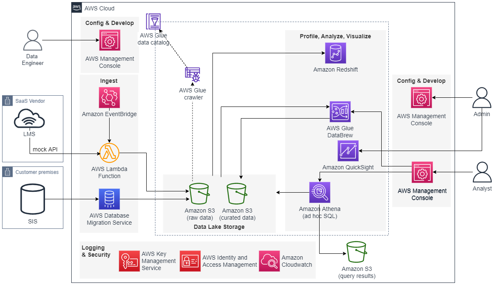

# Experiment with AWS

AWS teams constantly produce content to help builders get started on the plaftform.

These contents are often delivered as AWSImmersion Days, events that are designed to educate you about AWS products and services and help you develop the skills needed to build, deploy, and operate your infrastructure and applications in the cloud. 

Immersion Days leverage a modular content format and are structured to provide general overviews of a given service or solution. Hands on labs provide you with an immersive experience in the AWS console. 

Sessions are usually delivered by AWS Solutions Architects, AWS Partners and subject matter experts. 

Events takes place in person and virtually, and are usually free!!

So do not hesitate to register and attend : https://aws-experience.com/emea/france/events

## About these labs

As this is not an AWS sponsored event, you will use your own AWS account with the [AWS Free Tier](https://aws.amazon.com/free).

The AWS Free tier provide $100 USD of credits at sign-up and up to $100 USD more to earn as you explore key AWS services. 

You can test drive AWS services with the Free Plan for up to 6 months. 

You won't be charged unless you choose the Paid Plan. **However, switching to a Paid Plan may happen without you noticing, and there no way back to the Free Tier!!! .**

So be really carefull not activate certain service that will automatically switch you to the Paid Plan.

As mentionned in the [FAQ](https://aws.amazon.com/free/free-tier-faqs/):

   When your account joins an AWS Organization or sets up an AWS Control Tower landing zone, your Free Tier credits expire immediately, and your account will be ineligible to earn more AWS Free Tier credits. Additionally, your free account plan will automatically be upgraded to a paid plan.

## Enable Amazon IAM Identity Center without Organization

Make sure to ue the AWS Region: **US East (N. Virginia)**.

In order to use Amazon SageMaker Unified Studio, you will need to enable Amazon IAM Identity Center without Organization. If you enable it with Organisations, then your AWS account will switch to a Paid plan.

After signing in to your AWS account console, navigate to :

 - https://eu-west-1.console.aws.amazon.com/singlesignon/home?region=eu-west-1

Click on **Enable**.

Click on **enable an account instance of IAM Identity Center**.

Then you can review the settings and clickon **Enable**.

## Workshop content

Once, you open the workshop page, you can use the menus on the left side to navigate the content.

> Please take the time to read the content of the Immersion day as it provide all the instructiuons required to complete the labs along with valuable knowledge.

### Cleanup

The cost of the AWS resources used in workshops is about $5 to 10$ per day.

> **If you don't complete the Cleanup section, you may incur charges that will be billed to the payment method provided during the signup..**

## Amazon SageMaker Unified Studio Workshop

The [**Amazon SageMaker Unified Studio Workshop - Improve Student Engagement**](https://catalog.us-east-1.prod.workshops.aws/workshops/1e711c46-2bda-4c72-9f62-fde6347800f8/en-US) provides hands-on experience in developing data-driven, GenAI-powered solutions that deliver measurable business value.

In this workshop, you will learn how to use Amazon SageMaker Unified Studio features to simplify and unify the development of ML models and GenAI applications for improving student engagement.

Many universities are interested in building ML models and GenAI applications for improving student engagement. This workshop will simulate a real-world scenario through the lens of different data professionals addressing actual business challenges. You'll experience the end-to-end process, from initial data analysis to deploying a GenAI-powered tailored student engagement

#### Access the lab content

The content of the [**Amazon SageMaker Unified Studio Workshop - Improve Student Engagement**](https://catalog.us-east-1.prod.workshops.aws/workshops/1e711c46-2bda-4c72-9f62-fde6347800f8/en-US) is publcly available here:

- https://catalog.us-east-1.prod.workshops.aws/workshops/1e711c46-2bda-4c72-9f62-fde6347800f8/en-US

Please use the **N. Virginia (us-east-1)** region.

When creating your Amazon SageMaker Unified Studio domain, please use the **Create VPC** to create the required VPC resources and avoid later issues.

The created can be reused by any other Amazon SageMaker Unified Studio domain.

> Please take the time to read the content of the Immersion day as it provide all the instructiuons required to complete the labs along with valuable knowledge.

## Higher Education Data Lake Immersion Day

The [**Higher Education Data Lake Immersion Day**](https://catalog.workshops.aws/dataedu-student-datalake/en-US) will expose you to a reference architecture for a comprehensive array of potential data sources. This workshop provides you with specific skills and experience with the most common ones.

#### Access the lab content

The content of the [**Higher Education Data Lake Immersion Day**](https://catalog.workshops.aws/dataedu-student-datalake/en-US) is publcly available here:

- https://catalog.workshops.aws/dataedu-student-datalake/en-US

When you reach the **[How to start](https://catalog.workshops.aws/dataedu-student-datalake/en-US/300-how-to-start)** section, please follow the **[Self-paced labs](https://catalog.workshops.aws/dataedu-student-datalake/en-US/300-how-to-start/320-self-paced-labs)** and not the *AWS Event*.

As you already signed up for an Amazon Web Services (AWS) account and have Administrator access, you can go directly to [Launch CloudFormation stack for self-paced labs](https://catalog.workshops.aws/dataedu-student-datalake/en-US/300-how-to-start/320-self-paced-labs/323-launch-cloudformation-stack-for-self-paced-labs).

Please use the **N. Virginia (us-east-1)** region.

> Please take the time to read the content of the Immersion day as it provide all the instructiuons required to complete the labs along with valuable knowledge.

## Cleanup

The cost of the AWS resources used in workshops is about $5 to 10$ per day.

The majority of that expense results from the sample SIS database deployed on **Amazon RDS** and the **AWS Database Migration Service** replication instance used to snapshot the SIS data into S3 and illustrate how to build a data lake from a relational database of any type.

Make sure to complete the [Cleanup](https://catalog.workshops.aws/dataedu-student-datalake/en-US/10000-cost-optimization-cleanup) section once you are done.