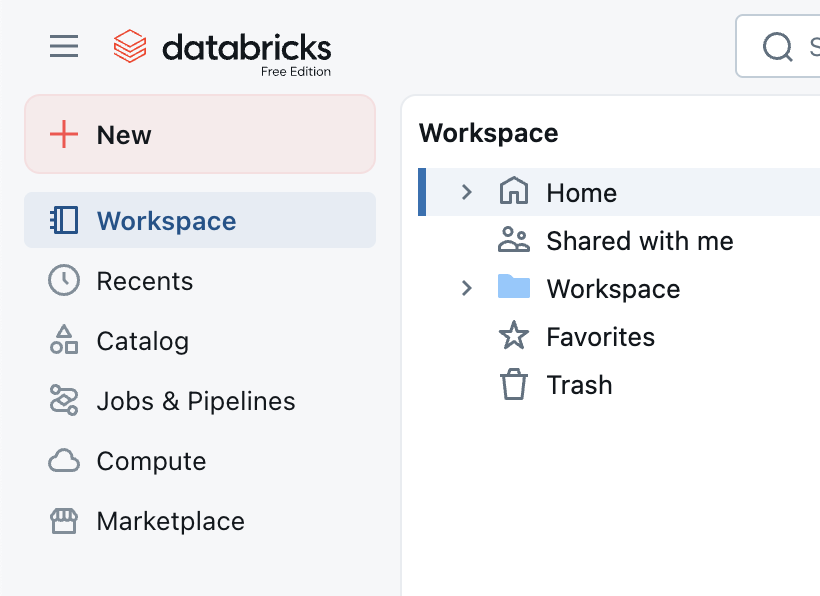
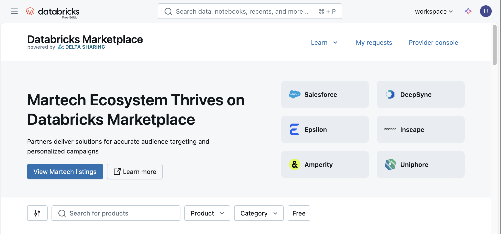
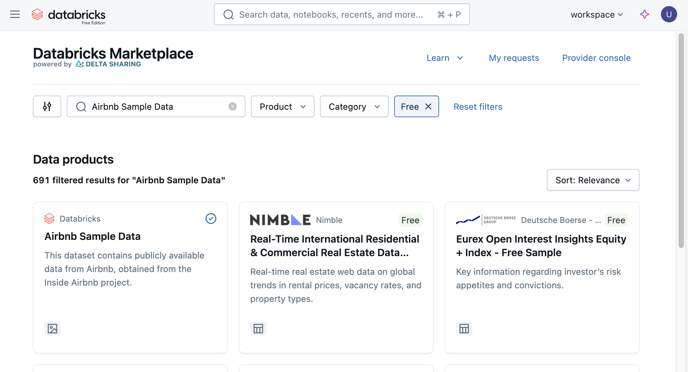
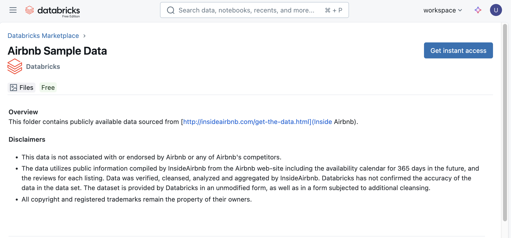
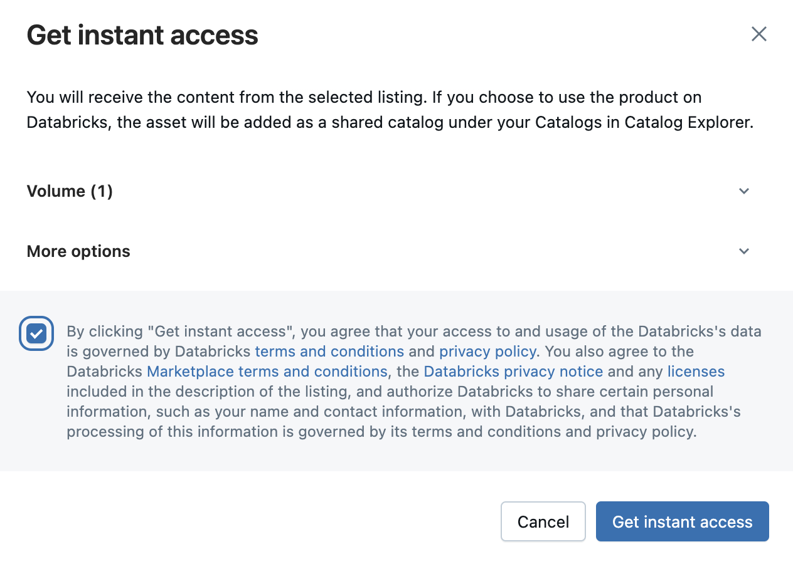
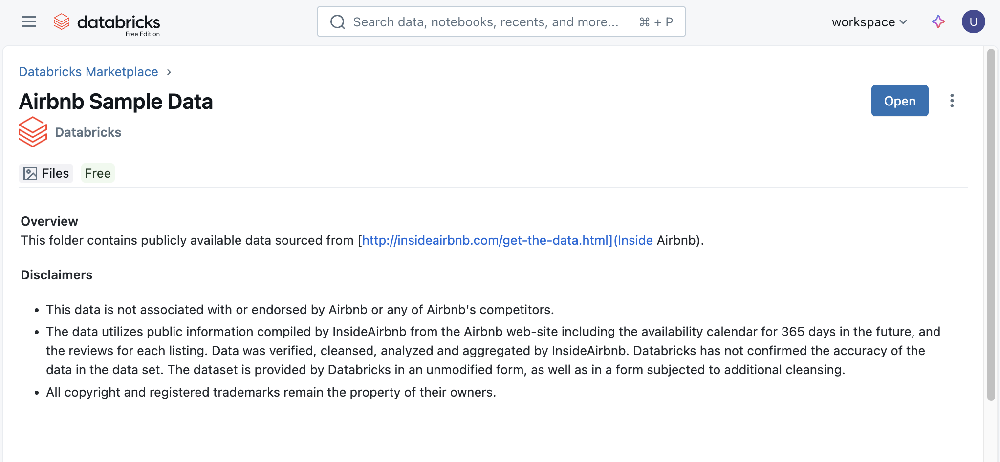
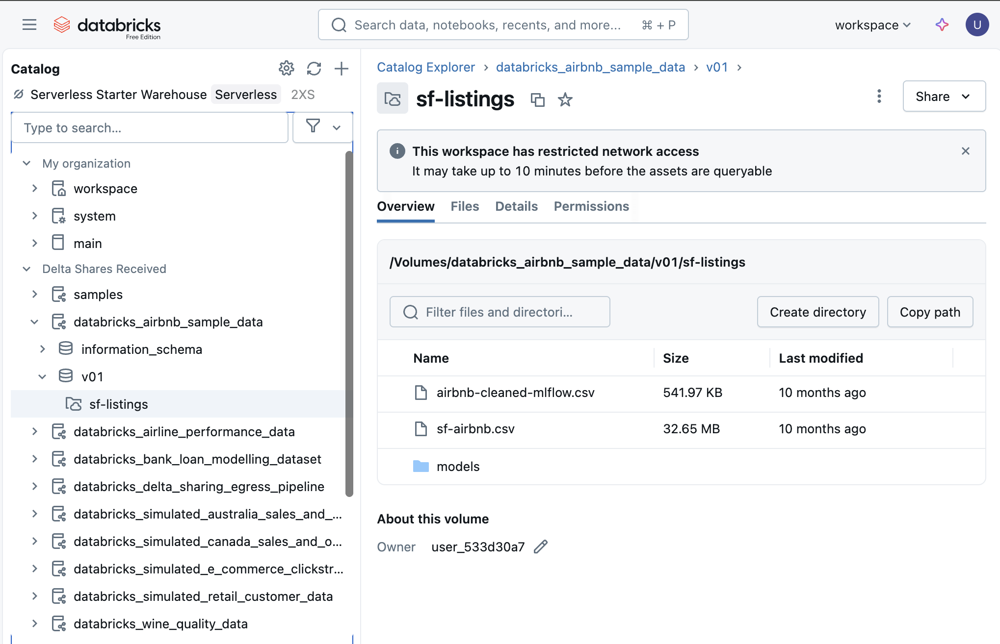

# Experiment with Databricks 

In today's data-driven world, the ability to efficiently manage, analyze, and leverage vast amounts of data is paramount. Throughout this guide, we will delve into the powerful Data Warehouse capabilities offered by [Databricks' Data Intelligence Platform](https://www.databricks.com/product/data-intelligence-platform?scid=7018Y000001f8FCQAY&utm_medium=paid+search&utm_source=google&utm_campaign=20771864814&utm_adgroup=156427295235&utm_content=product+page&utm_offer=data-intelligence-platform&utm_ad=680871359451&utm_term=databricks%20data%20intelligence%20platform&gad_source=1&gclid=CjwKCAjw34qzBhBmEiwAOUQcF-hqWqbXrioiwvd4lE9hahjCdgZ8l9ZFU_83t5wToaxJCHbLcguKQxoCzeQQAvD_BwE), illustrating how it stands as a cornerstone for modern data operations.

Firstly, you will have signed up with a Databricks Free Edition account, which takes about a few minutes and then you will have the brand new Databricks workspace for all your data operations. 

## Databricks catalog and schema

By default, the Databricks Free Edition account includes one catalog  called `workspace` which hold a schema called `default`.

You will primarly be using this catalog and schema in the next labs.

## Datasets

In orer to execute the labs, you will need to get access to datasets that are not avaiable out of the box in your environment. 

However, these datasets are freely available in the Databricks Marketplace.

Open your Databricks console and select **Marketplace** from the left side panel:

The you can use the search bar to lookup for the following dataset:

- Airbnb Sample Data
- Airline Performance Data
- Simulated Retail Customer Data
- Simulated E-Commerce Clickstream Data
- Simulated Canada Sales and Opportunities Data
- Simulated Australia Sales and Opportunities Data
- Wine Quality Data

The search will return a list of entries, click on the corresponding tile:

Once you click on one of the tile, you will get access to the details view of the Databricks Marketplace entry.

Review the detials then click on **Get instant access**.

Review the access details and review the terms and conditions. Once review, thick the check box, and click on  **Get instant access**.

Once you confirm you want to get access, click on **Open**.

This will take you to the Catalog explorer.

The dataset will appear under the **Delta Share Received**.

## Setting up Git Integration in your workspace

In order to clone, pull and push back content to Git, you will need to enable the Git integration in your workspace.

Click your profile  avatar at the top right corner in your Databricks Workspace, and then go to  **Settings -> Linked accounts -> Git provider -> Personal access token**, input your Token and then click Save as below.

For more detail and on how to create a Github token, please refer to  [Configure Git credentials & connect a remote repo to Databricks](https://docs.databricks.com/aws/en/repos/get-access-tokens-from-git-provider).

## Cloning the Git repository in your workspace

In order to clone the labs content, you will need to clone the following repository:

- https://github.com/adadouche/esigelec-2025-students
